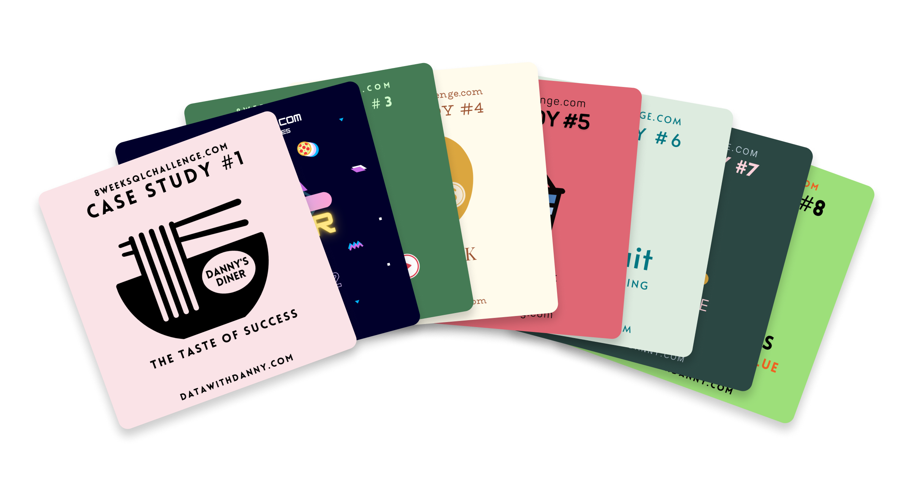
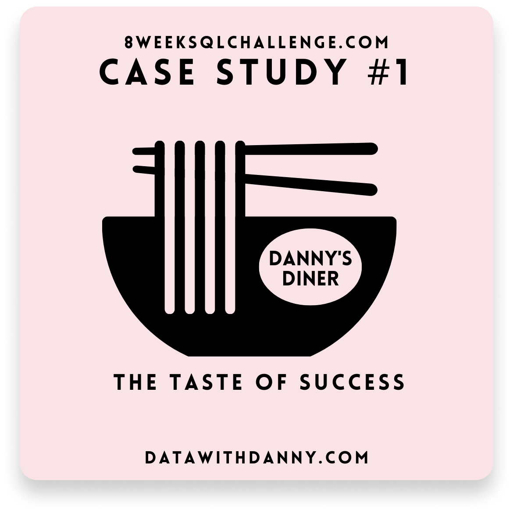
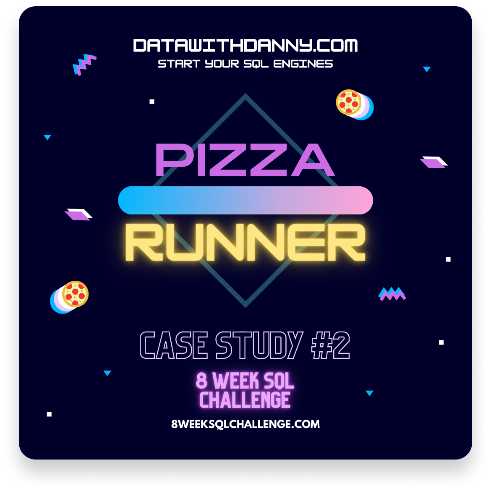
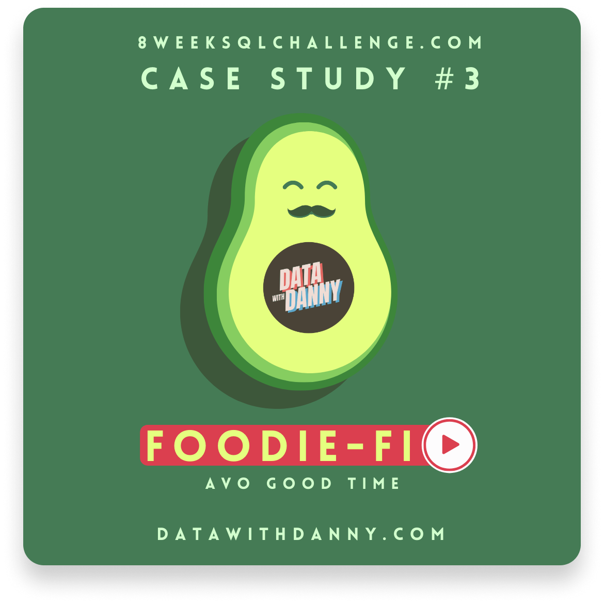
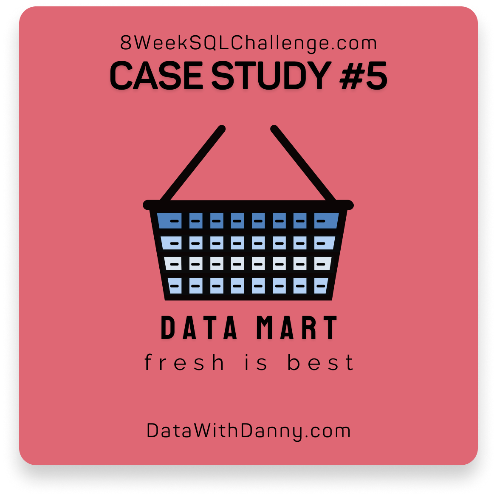
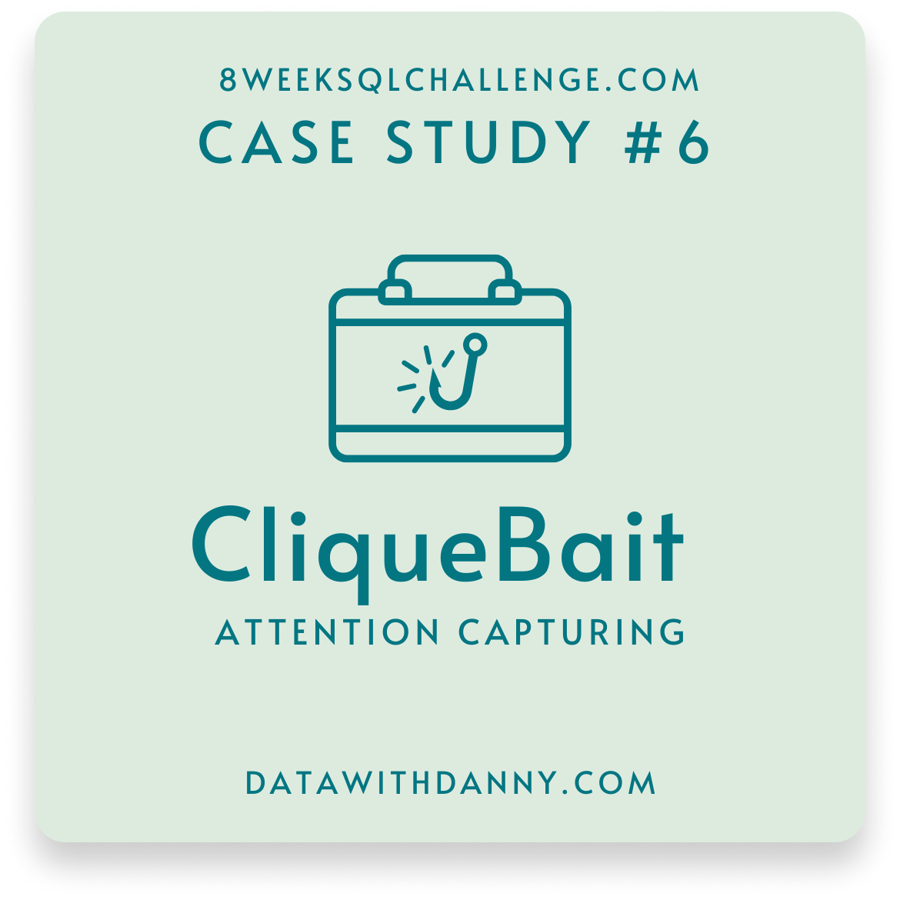
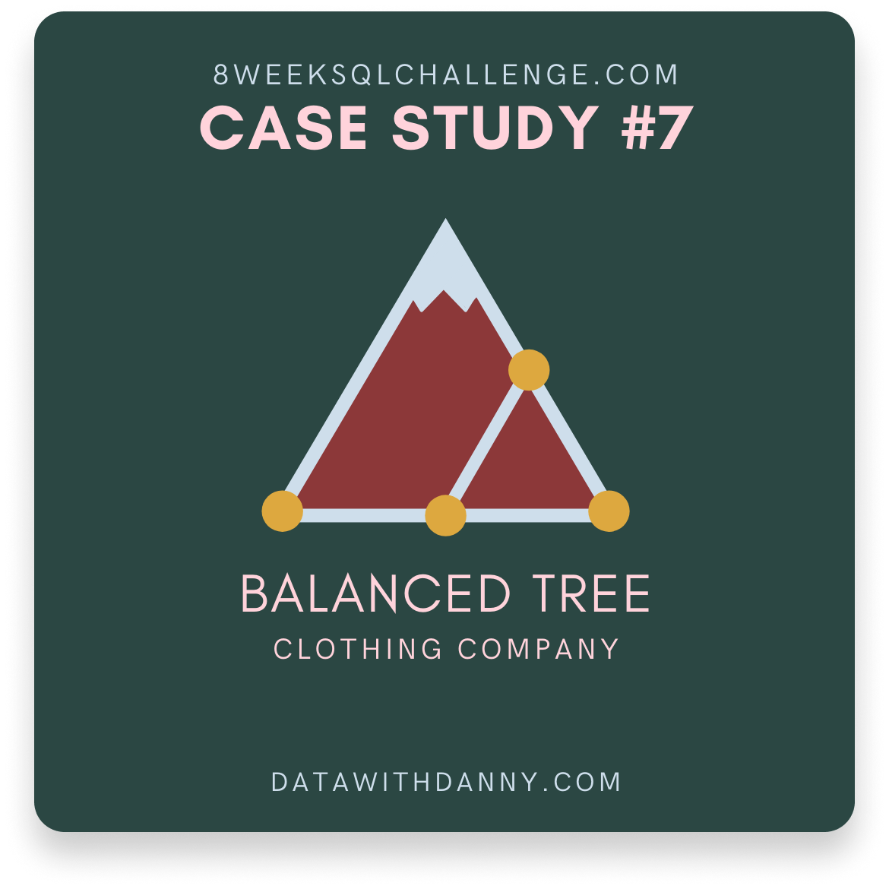
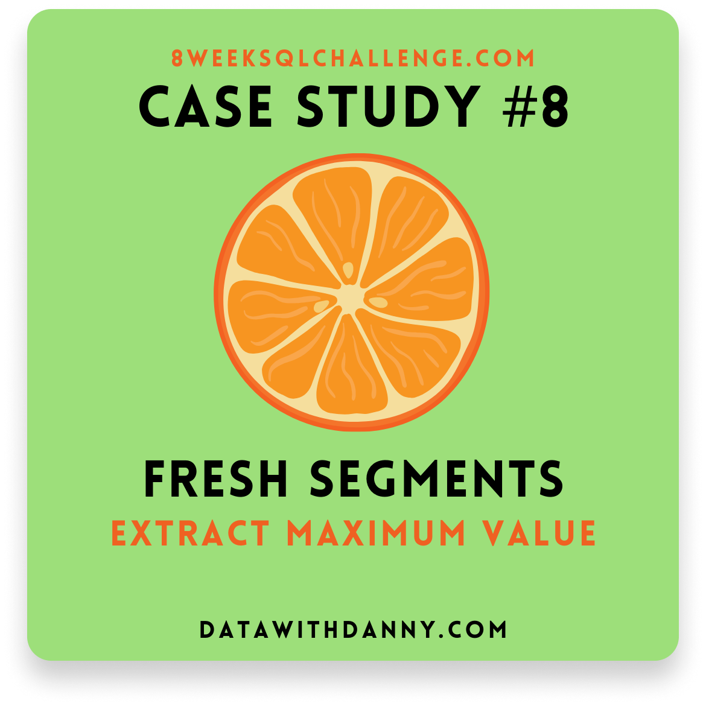

# 🔥🗓️ 8 Week SQL Challenge

👋  Hi! This repository contains my solutions for the [8 Week SQL Challenge](https://8weeksqlchallenge.com/), featuring **140+ business problems** to be solved using SQL, covering customer segmentation, churn analysis, and financial reporting across e-commerce, subscription services, and fintech industries.

***If you found it useful, consider giving it a*** ⭐️ ***!***

---

### 🎯 Why I Took This Challenge
I completed this challenge to enhance my data querying and analysis skills, becoming a more autonomous Product Manager in data-driven decision making.

### ⚡️ SQL Skills & Features Applied
Through these progressively complex cases, I developed proficiency in the following SQL skills and techniques:

| SQL Skill / Feature | Syntax Examples |
|:------------------|:----------------|
| Advanced Analysis | `PERCENTILE_CONT()`, `PERCENTILE_DISC()`, *Moving Averages* |
| Aggregate Functions | `SUM()`, `COUNT()`, `AVG()`, `MIN()`, `MAX()` , `GROUP BY`|
| Conditional Statements | `CASE WHEN ... THEN ... ELSE ... END` |
| Complex Joins | `INNER JOIN`, `LEFT JOIN`, `RIGHT JOIN`, *Self Joins* |
| Conditional Aggregation | `SUM(CASE WHEN ... THEN 1 ELSE 0 END)` |
| Core Query Structure | `SELECT`, `FROM`, `ORDER BY`, `LIMIT` |
| CTEs & Subqueries | `WITH cte_name AS (...)`, `FROM (SELECT… FROM…)` |
| Data Manipulation & Unnesting | `INSERT`, `UPDATE`, `DELETE`, `CREATE TABLE`, `UNNEST()` |
| Data Type Conversion | `::INT`, `::DATE`, `CAST()` |
| Date Functions | `DATE_TRUNC()`, `EXTRACT()`, `MAKE_DATE()`, `TO_CHAR()` |
| Generate Series | `GENERATE_SERIES()` |
| Lag/Lead Functions | `LAG()`, `LEAD()` |
| Mathematical Functions | `ROUND()`, `CEIL()`, `FLOOR()`, `STDDEV_SAMP()` |
| Null Handling | `COALESCE()`, `NULLIF()`, `IS NULL`, `IS NOT NULL` |
| Primary & Foreign Keys | `ADD CONSTRAINT pk_name PRIMARY KEY`, `FOREIGN KEY` |
| Ranking Functions | `RANK()`, `DENSE_RANK()`, `ROW_NUMBER()` |
| Regular Expressions | `REGEXP_REPLACE()` |
| Row & Aggregate Filtering | `WHERE`, `HAVING` | 
| String & Array Functions | `TRIM()`, `CONCAT()`, `STRING_TO_ARRAY()`, `REGEXP_REPLACE()` |
| Union Operations | `UNION ALL`, `UNION` |
| Window Functions | `OVER (PARTITION BY ... ORDER BY ...)` |

### 🧰 Environment Setup 
For these exercises, I chose PostgreSQL as it has been the most popular DBMS for the second consecutive year, according to the [2024 Stack Overflow Developer Survey](https://survey.stackoverflow.co/2024/technology#1-databases:~:text=PostgreSQL%20debuted%20in%20the%20developer%20survey%20in%202018%20when%2033%25%20of%20developers%20reported%20using%20it%2C). This reinforces my SQL skills while staying aligned with industry standards and current trends.

Additionally, I used [DataGrip](https://www.jetbrains.com/datagrip/) as my database IDE and set up the provided databases on a local PostgreSQL server to simulate a more realistic environment, rather than using the sandbox [DB Fiddle](https://www.db-fiddle.com/f/2rM8RAnq7h5LLDTzZiRWcd/138) environment provided by the case author.

### 🙌 Special thanks to
[@MarianaMannes](https://github.com/marianamannes), my friend and former colleague, for pointing me to these exercises when I said I wanted to sharpen my SQL skills. [@DannyMa](https://github.com/datawithdanny) for creating such well-designed cases. And the [DataGrip](https://www.jetbrains.com/datagrip/) team for generously extending my trial license so I could work on the exercises with their awesome tool.

### 💡 Before You Start
Feel free to copy or adapt my answers — they’re meant to be shared.  If you notice a mistake or want to discuss any solution, I’d be happy to hear from you at ola@pedropalmier.com.

# 🏃🏻‍♂️‍➡️ Case Studies & My Solutions

---
© ***Pedro Palmier** • September 2025*
